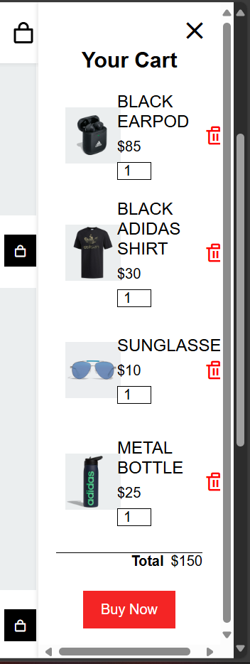
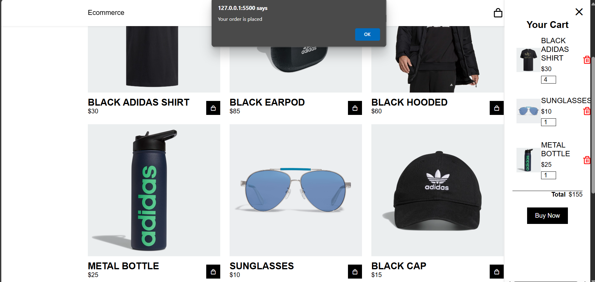

# 🛍️ Simple E-Commerce Shopping Cart

A fully functional frontend shopping cart system built using **HTML**, **CSS**, and **JavaScript**. Users can add items to the cart, adjust quantities, and view the total amount—all with a clean and responsive design.

---

## 🔧 Features

- 🛒 Add items to cart
- ❌ Remove items from cart
- 🔢 Update item quantity
- 💰 Dynamic total price calculation
- ✅ Responsive layout
- 🧾 Scrollable cart (when content overflows)

---

## 🖼️ Demo

 




---

## 🚀 Getting Started

### 1. Clone the Repository


📁 Project Structure

```
ecommerce-website/
│
├── index.html
├── README.md
│
├── css/
│   └── style.css
│
├── js/
│   └── main.js
│
├── img/
│   ├── preview.png
│   ├── preview1.png
│   ├── preview2.png
│   ├── preview3.png
│   ├── product1.jpg
│   ├── product2.jpg
│   ├── product3.jpg
│   ├── product4.jpg
│   ├── product5.jpg
│   ├── product6.jpg
│   ├── product7.jpg
│   └── product8.jpg

```

📦 Built With

HTML5

CSS3

Vanilla JavaScript (ES6)

🙌 Acknowledgements
Icons by Boxicons

